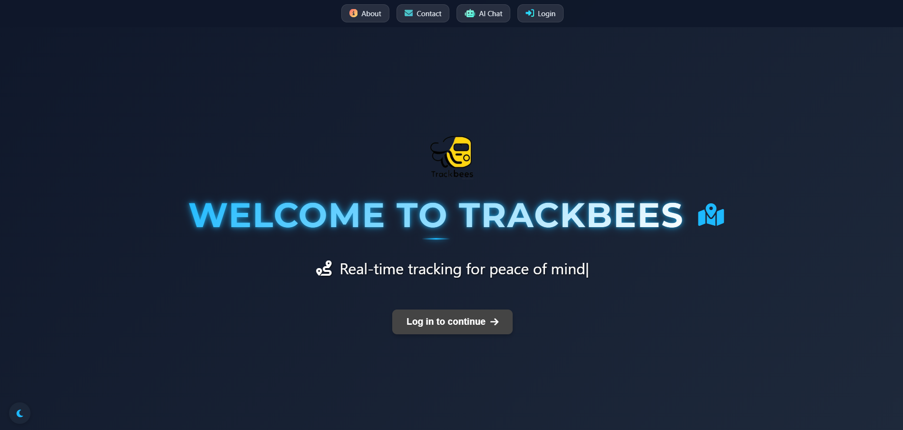
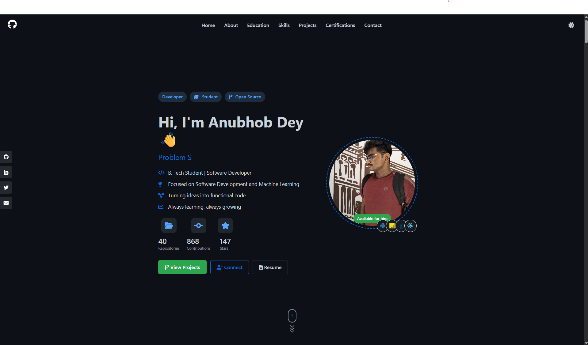

  

    
    

      <h1 style="color: white; text-shadow: 2px 2px 4px #000;">Hi, Anubhob here👋</h1>

  

## 💫 About Me
-  Currently building **"Shuttle for Students"** - a platform that [brief description of what it does]
-  Looking to collaborate on innovative projects focusing on [specific areas of interest]
-  Seeking help with frontend development (React, Vue) and agile project management
-  Learning RESTful API integration, GraphQL, and scaling applications for production
-  Ask me about my project architecture decisions and technical vision
-  Fun fact: I started my coding journey with Scratch at age 15 and built my first full app within a month!
-  [Visit my portfolio](https://www.anubhobdey.me) to see my latest work

## 🌐 Connect With Me
 

## 💻 Tech Stack

### Languages

### Frameworks & Libraries

### Cloud & Tools

## 🚀 Featured Projects
<table>
  <tr>
    <td width="50%">
      <h3 align="center">Shuttle for Students</h3>
      

        
        
<strong>Tech Stack:</strong> [React, Node.js, MongoDB, Google Maps API ]

        
[ntroducing TrackBees, a comprehensive vehicle tracking solution developed for my university's transport system. This web application utilizes GPS technology and real-time mapping to provide live tracking of university buses, helping students and staff monitor bus locations and estimated arrival times efficiently.]

      

    </td>
    <td width="50%">
      <h3 align="center">[Portfolio Website]</h3>
      

        
        
<strong>Tech Stack:</strong> [Python Flask, HTMl, CSS, Javascript]

        
[A modern portfolio website featuring an integrated AI assistant powered by Google's Gemini API. This project showcases my work while providing interactive assistance to visitors. The AI can answer questions about my projects, skills, and experience, creating an engaging user experience.]

      

    </td>
  </tr>
</table>

## 📊 GitHub Stats

## 🏆 GitHub Trophies

## 🎓 Education & Certifications
- 🎓 [B. Teach] from [University of Engineering and Management, Kolkata] - [2026]
- 📜 [Computer Science and Engineering (AI & ML)] - [UEMK] - [2026]

## ✍️ Random Dev Quote

## 💼 Want to hire me? Here's my resume!
- 📄 [My Resume](static/new_cv.pdf)
- 📬 Email me at: [anubhob435@example.com]

---

